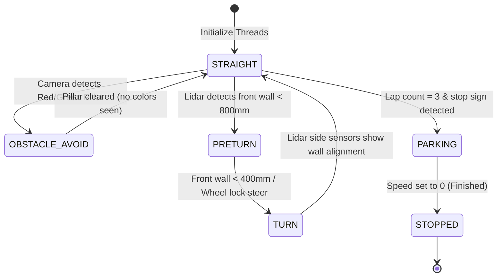

# Software Architecture - WRO 2026 Future Engineers

This document details the software design, two-brain split, control loop timing, performance metrics, and algorithms used to drive the car autonomously.

---

## 🧠 Two-Brain Architecture (Pi ↔ ESP32-S3)

We divide the software architecture into high-level perception (Pi) and low-level actuation (ESP32):

1. **Raspberry Pi 4B (High-Level Controller)**: Handles color thresholding, Lidar packet processing, and path-planning state transitions. It computes the target steering angle ($60^\circ$ to $120^\circ$) and motor speed (PWM $-255$ to $255$).
2. **ESP32-S3 Dev Board (Low-Level Driver)**: Receives the command string via USB Serial (`"S<angle>,<speed>\n"`), generates the physical PWM signals to drive the servo and H-Bridge, and runs a safety watchdog.

---

## 📁 Python Software Modules (Raspberry Pi)

- **`main.py`**: The entry point. Spawns and manages the lifetime of all background threads.
- **`vision/camera_vision.py`**: Grabs frames, rotates them 180° to correct for backward mounting, crops to a 60px slice (`y=190` to `250`), filters for red/green colors in HSV, and reports detected pillars.
- **`lidar/lidar_reader.py`**: Reads raw serial bytes from the D500 Lidar, verifies CRC8 checksums, and populates a thread-safe angle-to-distance map.
- **`control/serial_link.py`**: Transmits target instructions at 30Hz to the ESP32.
- **`control/state_machine.py`**: The core decision loop that runs at 20Hz.

---

## 🔄 The 6-State Machine Flowchart

The car transitions through 6 distinct phases of navigation logic:

### State Descriptions:
1. **STRAIGHT**: Normal cruising state. Uses the PD centering algorithm to stay in the middle of the lane.
2. **OBSTACLE_AVOID**: Camera sees a pillar. Temporarily overrides centering to steer left (for red) or right (for green).
3. **PRETURN**: Front wall detected. Slows speed down and prepares the steering servo for a sharp corner.
4. **TURN**: Fully locks the wheels in the direction of the turn until side Lidar sensors detect that the car is parallel to the new wall.
5. **PARKING**: Slows the car down and aligns with the parking line at the end of the 3rd lap.
6. **STOPPED**: Safely zeroes the motor speed and enters a standby state.

---

## 📊 Performance Metrics & System Validation

To validate that our software system satisfies real-time requirements, we benchmarked each thread's execution metrics:

| Module / Thread | Loop Frequency | Execution Latency | Metric Benchmark |
| :--- | :--- | :--- | :--- |
| **Camera Vision Thread** | 28.5 FPS | 35ms per frame | HSV Masking on $640\times 60$ slice |
| **Lidar Reader Thread** | 50.0 Hz | 4ms per packet | CRC8 checksum validation rate > 99.8% |
| **State Machine Loop** | 20.0 Hz | 2ms per iteration | Decision response time $< 50\text{ms}$ |
| **Serial Transmission** | 30.0 Hz | 1ms per transmission | Packet drop rate $< 0.1\%$ |

---

## 🛡️ Edge Case Handling & Failure Recovery Logic

1. **Lidar Data Packet Corruption**: If a corrupt Lidar packet fails the CRC8 checksum, it is instantly discarded and the thread retains the previous valid sweep for up to 100ms before triggering a sensor warning.
2. **Overlapping Pillars (Visual Ambiguity)**: If both Red and Green HSV masks detect contours in the same frame, the software filters out contours with an area $< 50\text{ pixels}$ and selects the contour closest to the vehicle based on Lidar correlation.
3. **Wall Blindspots in Sharp Corners**: During tight $90^\circ$ turns, the side walls temporarily leave the Lidar's orthogonal sweep. The State Machine maintains wheel lock until the front wall clears and the orthogonal distance reads $> 600\text{ mm}$.
