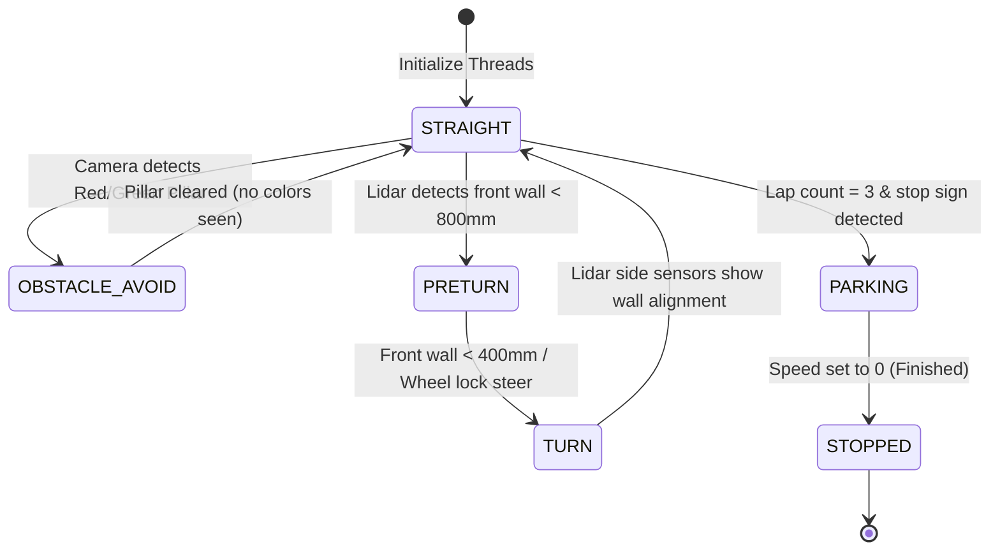

# Software Architecture - WRO 2026 Future Engineers

This document details the software design, two-brain split, control loop timing, and algorithms used to drive the car autonomously.

---

## 🧠 Two-Brain Architecture (Pi ↔ ESP32-S3)

We divide the software architecture into high-level perception (Pi) and low-level actuation (ESP32):

1. **Raspberry Pi 4B (High-Level Controller)**: Handles color thresholding, Lidar packet processing, and path-planning state transitions. It computes the target steering angle ($60^\circ$ to $120^\circ$) and motor speed (PWM $-255$ to $255$).
2. **ESP32-S3 Dev Board (Low-Level Driver)**: Receives the command string via USB Serial (`"S<angle>,<speed>\n"`), generates the physical PWM signals to drive the servo and H-Bridge, and runs a safety watchdog.

---

## 📁 Python Software Modules (Raspberry Pi)

- **`main.py`**: The entry point. Spawns and manages the lifetime of all background threads.
- **`vision/camera_vision.py`**: Grabs frames, rotates them 180° to correct for backward mounting, crops to a 60px slice (`y=190` to `250`), filters for red/green colors in HSV, and reports detected pillars.
- **`lidar/lidar_reader.py`**: Reads raw serial bytes from the D500 Lidar, verifies CRC8 checksums, and populates a thread-safe angle-to-distance map.
- **`control/serial_link.py`**: Transmits target instructions at 30Hz to the ESP32.
- **`control/state_machine.py`**: The core decision loop that runs at 20Hz.

---

## 🔄 The 6-State Machine Flowchart

The car transitions through 6 distinct phases of navigation logic:

### State Descriptions:
1. **STRAIGHT**: Normal cruising state. Uses the PD centering algorithm to stay in the middle of the lane.
2. **OBSTACLE_AVOID**: Camera sees a pillar. Temporarily overrides centering to steer left (for red) or right (for green).
3. **PRETURN**: Front wall detected. Slows speed down and prepares the steering servo for a sharp corner.
4. **TURN**: Fully locks the wheels in the direction of the turn until side Lidar sensors detect that the car is parallel to the new wall.
5. **PARKING**: Slows the car down and aligns with the parking line at the end of the 3rd lap.
6. **STOPPED**: Safely zeroes the motor speed and enters a standby state.

---

## ⚡ Key Control Algorithms

### 1. PD Wall-Centering Algorithm
To keep the car centered in the lane when driving straight, we run a **Proportional-Derivative (PD) controller** comparing the Lidar distances at 90° (left) and 270° (right):

$$\text{Error} = \text{Distance}_{\text{left}} - \text{Distance}_{\text{right}}$$

$$\text{Derivative} = \text{Error}_{\text{current}} - \text{Error}_{\text{previous}}$$

$$\text{Steering Offset} = (K_p \cdot \text{Error}) + (K_d \cdot \text{Derivative})$$

$$\text{Target Angle} = 90 + \text{Steering Offset}$$

* **Proportional Gain ($K_p = 0.05$)**: Corrects the angle based on how far the car is from the center.
* **Derivative Gain ($K_d = 0.02$)**: Dampens the steering to prevent the car from over-correcting and fish-tailing.

### 2. LiDAR-Camera Obstacle Correlation
Since the camera Rev 1.3 is mounted backwards/upside-down, pixel area alone cannot reliably determine which pillar is closest to the bumper. We correlate the camera's visual output with the Lidar's distance sweep:
- The camera reports the horizontal center coordinate (`center_x` in pixels) of a red or green pillar.
- We map `center_x` (from column `60` to `580`) to a specific angular segment of the Lidar's field of view (e.g., between `160°` and `200°`).
- The State Machine cross-references the Lidar's exact distance reading at that mapped angle.
- This tells the car **exactly how far away the pillar is** and lets it ignore distant background noise.
